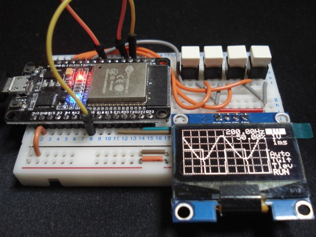
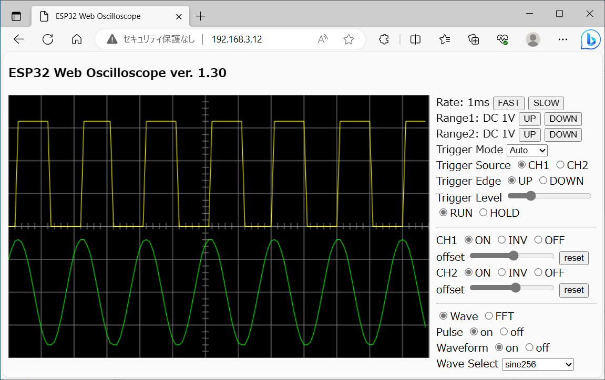
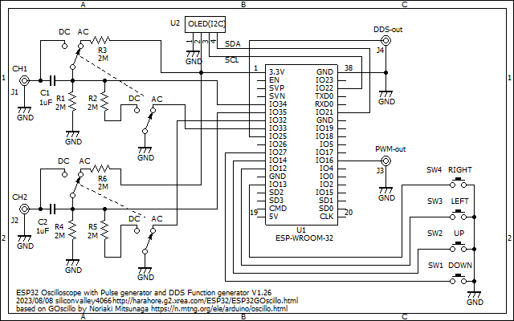

# ESP32OLEDOscilloscope
ESP32 Oscilloscope for OLED and wireless WEB display

Warning!!!
Use old esp32 by Espressif Systems version 2.0.17. 
New version 3.0 and later does NOT support backward compatibility.

This displays an oscilloscope screen both on a 128x64 OLED and also on the WEB page simultaneusly.
The settings are controled by four tactile switches and also on the WEB page.
You can view the oscilloscope screen on the WEB browser of the PC or the tablet or the smartphone.

Specifications:
<li>Dual input channel</li>
<li>Input voltage range 0 to 3.3V</li>
<li>12 bit ADC 250 ksps single channel, 10 ksps dual channel</li>
<li>Measures minimum, maximum and average values</li>
<li>Measures frequency and duty cycle</li>
<li>Spectrum FFT analysis</li>
<li>Sampling rate selection</li>
<li>Built in Pulse Generator</li>
<li>Built in DDS Function Generator</li>
 

Develop environment is: 
Arduino IDE 1.8.19 
esp32 by Espressif Systems version 2.0.11 
CPU speed 240 MHz 

Libraries: 
Adafruit_SSD1306 
Adafruit_SH110X 
arduinoFFT by Enrique Condes 2.0.0 
arduinoWebSockets from https://github.com/Links2004/arduinoWebSockets 

4usec/div range is 10 times magnification at 250ksps. 
8usec/div range is 5 times magnification at 250ksps. 
20usec/div range is 2 times magnification at 250ksps. 
The magnification applies sin(x)/x interpolation.

For WEB operations, edit the source code WebTask.ino and replace your Access Point and the password.
<pre>
Edit:
const char* ssid = "XXXX";
const char* pass = "YYYY";
To:
const char* ssid = "Your Access Point";
const char* pass = "Your Password";
</pre>

Schematics: 

Description is here, although it is written in Japanese language: 
https://ss1.xrea.com/harahore.g2.xrea.com/ESP32/ESP32WebOscillo.html
